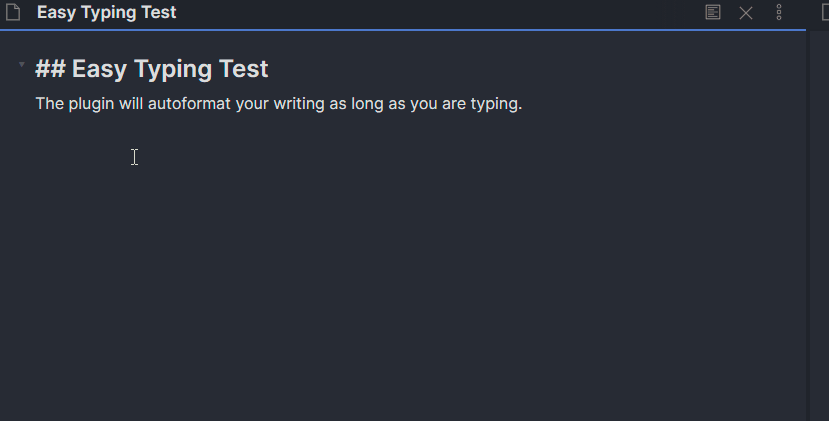

# Easy Typing
这是一个 [Obsidian](https://obsidian.md/) 的书写体验增强插件。
## Easy Typing 插件
[English README](#Easy-Typing-Plugin)

本插件可以在笔记编辑过程中自动格式化书写，比如自动在中英文之间添加空格，让中文用户的 Obsidian 书写体验起飞~

- 运行测试
  - [x] windows10 obsidian v0.11.13
  - [x] ubuntu18.04, obsidian v0.11.13
  - [ ] Mac（没有设备，无法测试...）
### 插件功能
在 Windows10 和ubuntu18.04，obsidian v0.11.13 上测试可用。
- 编辑过程中行内自动格式化
	- [x] 中英文之间自动补全空格，包括中文前的英文标点(`',.;?'`)
	- [x] 行内 latex 公式(比如：$x=y$)和中英文之间自动补全空格
	- [x] 行内代码片段和中英文间及相关标点的自动补全空格
	- [x] 英文句首字母和前面的标点 (`',.;?'`) 中间自动添加空格。
    - [x] 英文行首字母大写
	- [x] 行内小括号与文本的自动空格
- 插件设置面板
    - [x] 自动格式化总开关
    - [x] 单个行内自动格式化功能都可以分别关闭、打开
- 快捷键/命令
	- [x]  格式化当前行
    - [ ]  一键全文格式化
### 展望功能/改进空间
- [ ] 选中文本的功能？目前没有好的想法来实现该功能。
	- [ ] 选中文本情况下，按中文的￥键，将自动替换成$，变成行内公式
	- [ ] 选中文本情况下，按中文的·，将自动替换成`，变成行内代码块
- [ ] 用户自定义正则表达式及其替换规则？
### 手动安装插件

将 `main.js`, `styles.css`, `manifest.json` 复制到您的保管库 `VaultFolder/.obsidian/plugins/your-plugin-id/` 中。

### Changelog
- v2.3.0
  - improvement
    - 增加了对obsidian 和 zotero 链接的识别（`obsidian://`, `zotero://`），链接内部不自动 format
  - Bug fix
    - 修复了对部分链接内部字符无法识别的bug
- v2.2.0
  - improvement
    - 去除部分冗余代码
    - 对main.ts中类重新命名
- v2.1.0
  - bugs fix    
    - 修复上个版本中链接在某些情况下还是会被格式化的bug
- v2.0.0
  - Improvement
    - 独立设置数字和英文文本，标点的空格，数字和`.`不空格
    - list，checkbox 中支持英文行首字母大写
    - 自动识别网址链接，不格式化网址链接部分内容
    - 识别 WikiLink 和 MarkDown link，不格式化其内容
    - 设置面板分类更加清晰
  - Bug fix
    - inline 元素的范围识别逻辑
- v1.0.0
  - 基本功能完成
---
## Easy Typing Plugin
This plugin designed for better typing experience.

- Have been testted on
  - [x] windows10 obsidian v0.11.13
  - [x] ubuntu18.04, obsidian v0.11.13
  - [ ] Mac (have no device)

### Feature
- auto formatting when editting
  - [x] auto spacing between Chinese and English
  - [x] auto spacing between inline latex and text
  - [x] auto spacing between inline code and text
  - [x] space between English with punctuate
  - [x] capitalize the first letter of every sentence
  - [x] Space between English braces and text
- SettingTab
    - [x] switch auto formatting 
    - [x] switch every single rule of auto formatting
- short cut / command pane
    - [x] format current line
    - [ ] format current note 

### Notice
don't put your link inside inline code or inline formula, or autoformatting may not works

### Manually installing the plugin

- Copy over `main.js`, `styles.css`, `manifest.json` to your vault `VaultFolder/.obsidian/plugins/your-plugin-id/`.

### API Documentation

See https://github.com/obsidianmd/obsidian-api
