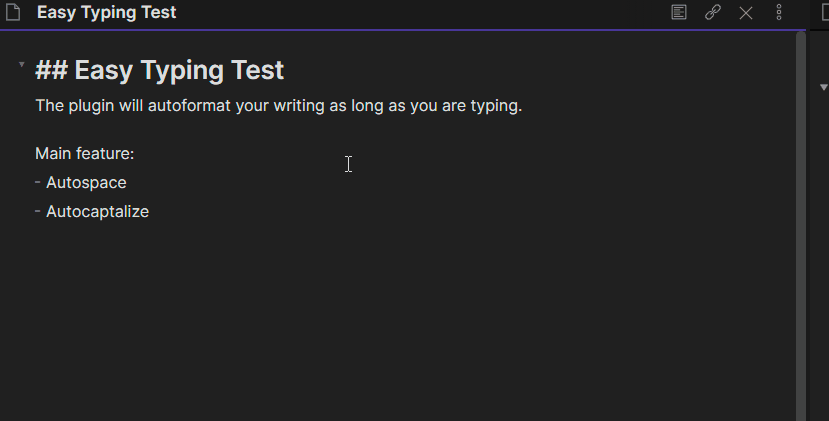
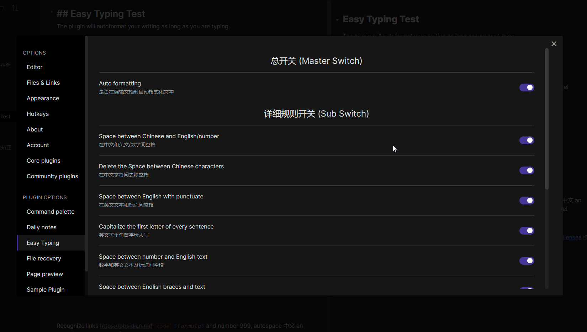

- [Easy Typing](#easy-typing)
  - [插件功能 Features](#插件功能-features)
  - [展望功能/改进空间 Future todo](#展望功能改进空间-future-todo)
  - [其他说明 Other explanation](#其他说明-other-explanation)
  - [手动安装插件 Manually installing the plugin](#手动安装插件-manually-installing-the-plugin)
  - [更新日志 Changelog](#更新日志-changelog)
## Easy Typing

这是一个 [Obsidian](https://obsidian.md/) 的书写体验增强插件。本插件可以在笔记编辑过程中自动格式化书写，比如自动在中英文之间添加空格，英文首字母大写，让中文用户的 Obsidian 书写体验起飞~

This plugin designed for better typing experience. Autoformat your note as typing (Auto captalize and autospace).

而且你可以在插件的设置面板自由地设置你想要的格式化功能

And you can set the formatting rules freely in the plugin Settings panel.

- 运行测试 Test on
  - [x] windows10 obsidian v0.11.13
  - [x] ubuntu18.04, obsidian v0.11.13
  - [ ] Mac（没有设备，无法测试...）

### 插件功能 Features
- 编辑过程中行内自动格式化
	- [x] 中英文之间自动补全空格，包括中文前的英文标点(`',.;?'`)
	- [x] 行内 latex 公式(比如：$x=y$)和中英文之间自动补全空格
	- [x] 行内代码片段和中英文间及相关标点的自动补全空格
	- [x] 英文句首字母和前面的标点 (`',.;?'`) 中间自动添加空格。
	- [x] 英文行首字母大写
  - [x] 行内小括号与文本的自动空格
  - [x] `[[WikiLink]]`, `[markdown link](https://)` 和 纯链接 `https://obsidian.md` 与文本的自动空格。
- 插件设置面板
  - [x] 自动格式化总开关
  - [x] 单个行内自动格式化功能都可以分别关闭、打开
- 快捷键/命令
	- [x]  格式化当前行
  - [x]  一键全文格式化
- [x]  全角符号输入增强
  - [x] 连续输入两个￥会变成$$，并将光标定位到中间，输入两个【会变成`[[cursor]]`，同理输入两个`·`会变成\`cursor\`
  - [x] 选中文本的功能 (Thanks to [renmu123](https://github.com/renmu123/obsidian-auto-pair-chinese-symbol)'s inspiration)
  	- [x] 选中文本情况下，按中文的￥键，将自动替换成\$，变成`$selected text$`
  	- [x] 选中文本情况下，按中文的·，将自动替换成`，变成行内代码块
    - [x] 选中文情况下，按中文的【，将自动变成`[selected text]`

---
- auto formatting when editting
  - [x] auto spacing between Chinese and English
  - [x] auto spacing between inline latex and text
  - [x] auto spacing between inline code and text
  - [x] space between English with punctuate
  - [x] capitalize the first letter of every sentence
  - [x] Space between English braces and text
  - [x] Auto space for `[[WikiLink]]`, `[markdown link](https://)` and bare link `https://obsidian.md` with other text。
- SettingTab
  - [x] switch auto formatting 
  - [x] switch every single rule of auto formatting
- short cut / command pane
  - [x] format current line
  - [x] format current note 
- [x] Full-width symbol enhancement
  - [x] Entering two ￥ in a row will become $$, and the cursor will be positioned in the middle, two【 will become `[[cursor]]`, two `·` will become \`cursor\`
  - [x] when something selected (Thanks to [renmu123](https://github.com/renmu123/obsidian-auto-pair-chinese-symbol)'s inspiration)
    - [x] pressing the `￥` will format the selected text to `$selected text$`
    - [x] pressing the `·` will format the selected text to inline code
    - [x]  pressing the `【` will format the selected text to `[selected text]`

### 展望功能/改进空间 Future todo
- [ ] 支持 emoji `:emoj:`的识别
- [ ] 支持一些英文常用缩写的识别
- [ ] 用户自定义正则表达式及其替换规则

### 其他说明 Other explanation

### 手动安装插件 Manually installing the plugin

- 下载最新的 release 包（不是源代码）, 将 `main.js`, `styles.css`, `manifest.json` 复制到您的保管库 `VaultFolder/.obsidian/plugins/your-plugin-id/` 中。
- Down load newest release (not source code). Copy over `main.js`, `styles.css`, `manifest.json` to your vault `VaultFolder/.obsidian/plugins/your-plugin-id/`.

### 更新日志 Changelog
- v3.1.9 2021.6.9
  - Bug fix
    - 修复 v3.1.8 全角输入增强对 Mac 版本 obsidian无效的问题
- v3.1.8 2021.6.9
  - Improvement
    - 增加了全角符号输入增强，现在连续两个￥￥会变成$$，并将光标定位到中间，输入两个【会变成`[[cursor]]`，同理输入两个`·`会变成\`cursor\`
    - 重写了splitLine函数，改善逻辑，增加可维护性，并支持行内`$$block formula$$`的识别。  
    - readme 增加了对插件设置面板的说明
- v3.1.7 2021.6.7
  - Improvement
    - selectFormat 增加了选中文本时按【则在文本两边增加`[]`的效果.
    - 现在选中文本再【或者￥后，文本还保持选中
    - list或者task内部开头的整行公式(如`$$x+y=z$$`)现在也能被识别，不会导致错误的格式化。
- v3.1.6 2021.5.28
  - Improvement
    - 在设置项增加了Debug，可以在控制台输出调试信息，方便调试。
  - Bug fix
    - 修复光标定位新行时，prevCursor没更新导致的bug。
- v3.1.5 2021.5.28
  - Bug fix
    - 修复了在text类型的行编辑后，光标定位到codeblock内编辑情况下，format会对codeblock起作用的bug。
- v3.1.4 2021.5.26
  - Improvement
    - Reduce computatio: 不再在每次按键输入时解析全文，分析段的类型，而是在文本行数变化，或者在本文增减 `$- 这几个符号的时候重新解析全文的行类型。 
    - Effect change: 修改了数字空格选项的逻辑，不再在数字与字母之间空格。
  - Bugs fix
    - set `manifest.json`: `"isDesktopOnly": true`, Since I'm using the CodeMirror 5 API
    - remove unused imports
    - unhook events in `onunload()`
- v3.1.3 2021.5.16
  - bug fix
    - [x] 修复了标题首字母大写不生效的bug
    - [x] 修复了`[https://xxx]()` mdlink中方括号内部两边会自动生成空格的问题。 
- v3.1.2 2021.5.16
  - bug fix
    - [x] 文本和inline元素之间打空格回多添加一个空格, that won't happen again.
- v3.1.1 2021.5.15
  - Improve
  	- [x] 选中文本情况下，按中文的￥键，将自动替换成$，变成行内公式
  	- [x] 选中文本情况下，按中文的·，将自动替换成`，变成行内代码块
- v3.1.0 2021.5.14
  - Improve
    - **增加了全文的内容识别，在全文语境下的代码块和公式中不自动格式化**
    - 增加了快捷键：全文格式化
    - 增加了快捷键：AutoFormat 开关切换
    - Md 链接将不论小括号内容
- v3.0.1
  - bug fix
    - 修复了inline code 等元素和前后的标点符号空格的bug。
- v3.0.0
  - Improvement
    - **重构代码逻辑**，提升可维护性
    - 增强了行内公式和行内代码块的识别逻辑
    - 增加了多种链接的识别：wiki link, markdown link and bare link.
    - 增加了多种链接的自动空格功能开关
    - 开发了**光标位置计算算法**，大大提升了行内编辑的体验
- v2.3.1
  - bug fix
    - [x] 修复数字和后面的冒号自动空格的 bug
- v2.3.0
  - improvement
    - 增加了对obsidian 和 zotero 链接的识别（`obsidian://`, `zotero://`），链接内部不自动 format
  - Bug fix
    - 修复了对部分链接内部字符无法识别的bug
- v2.2.0
  - improvement
    - 去除部分冗余代码
    - 对main.ts中类重新命名
- v2.1.0
  - bugs fix    
    - 修复上个版本中链接在某些情况下还是会被格式化的bug
- v2.0.0
  - Improvement
    - 独立设置数字和英文文本，标点的空格，数字和`.`不空格
    - list，checkbox 中支持英文行首字母大写
    - 自动识别网址链接，不格式化网址链接部分内容
    - 识别 WikiLink 和 MarkDown link，不格式化其内容
    - 设置面板分类更加清晰
  - Bug fix
    - inline 元素的范围识别逻辑
- v1.0.0
  - 基本功能完成